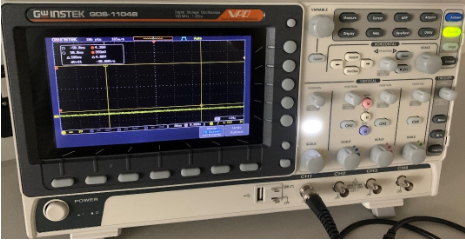
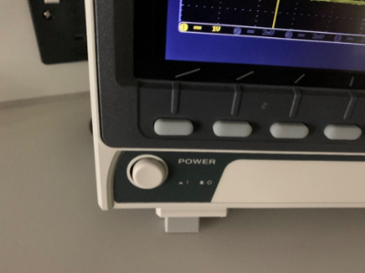
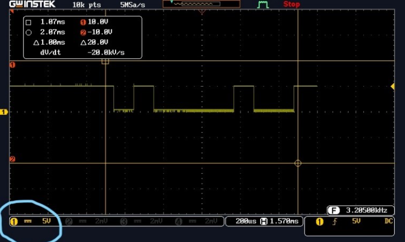
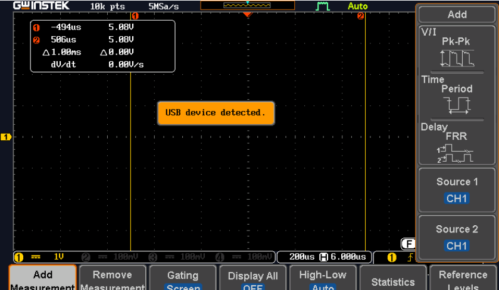
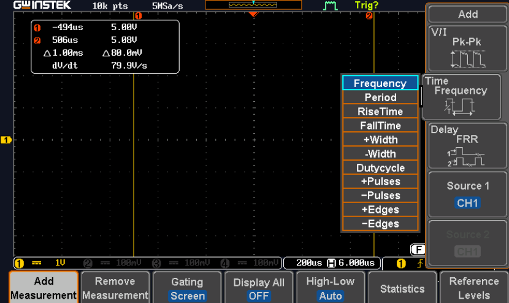
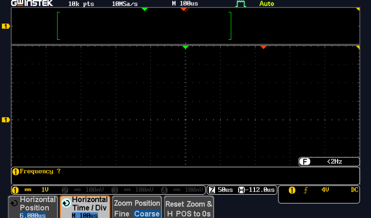

# Data Communication over Serial

This document will provide a instructions on how to use the oscilloscope, to read the electrical signal that is being transimitted from the Arduino Uno development board out of the Tx pin.

---
**As a reminder, you are to:**
1. Interrogate the signal displayed on the oscilloscope so that you translate the electrical signal to a series of 1's and 0's
   
2. Then workout which way the signal is being transmitted, is it Least to Most signficant bit or vice versa?

3. What is the decimal representation of the signal?

4. What is the ASCII character?

5. Calculate the speed of the transmitted signal

6. Reset the Arduino and do it again as many times as you like to get different signals

--- 

## Code Snippet

So you can see what is going on under the hood, the snippet of code below demonstates that all characters are randomly generated from the ASCII table:

You can see firstly that a random baudrate is selected by creating a random seed from the analogue pin 2 of the Arduino.

```c
randomSeed (analogRead(2));
Serial.begin(baudRate[random(0,3)]);
```

... Next a random symbol is picked from the printable ASCII table.

```c
randomSeed (analogRead(5));
int startingPos = 33;
int selectedPos = random(0,94);
char symbol = (char)(startingPos + selectedPos);
```

Finally, the symbol is sent to the Tx pin every 2 secs until you reset the Arduino, which then starts the whole sequence off again.

```c
while(true)
{
    Serial.print(symbol);
    delay(2000);
}
```
## Arduino Setup

1. Ensure one end of the one cable is secured into the TX connection (Tx->1) on the Arduino, the other end of the cable to be attached to the red oscilloscope crocodile clip. As shown below:

2. Similarly ensure that the Arduino has been grounded to the oscilloscope by connecting the GND pin of the Arduino to the black crocodile clip of the oscilloscope.

<p align="center">
  
&nbsp; &nbsp; &nbsp; &nbsp;
  
</p>

<p align="center">

</p>


3. Similarly ensure that the Arduino has been grounded to the oscilloscope by connecting the GND pin of the Arduino to the black crocodile clip of the oscilloscope.  

4. Now you can power on the Arduino with the power adapter provided.  

## Oscilloscope Setup
Using the oscilloscope, we will be able to capture the randomly generated signal being transmitted from the Arduino.
<p align="center">
  
</p>


5. Turn the oscilloscope on and ensure that the channel is connected to the selected the BNC cable connection. The Channel selected should be highlighted as shown below. The signal to be shown will represent the colour shown next to the scale, i.e. channel 1 will be yellow., channel 2 blue.  


<p align="center">
  
&nbsp; &nbsp; &nbsp; &nbsp;
  
</p>

6. Adjust the scale knob above the BNC connector to set the scale to the 2V range. Visible in the left-hand corner of the screen. 

<p align="center">
  
</p>

7. Press the button labelled measure. A list of commands will now be displayed on the screen, select  ‘Add Measurement’ option. 
   
<p align="center">
  
</p>

8. Next select the ‘time period’ option. Using the knob labelled ‘Variable’ highlight the frequency option and press select.  

<p align="center">
  
</p>

9. Press the measure button again to remove the menu

10.  Now press the Zoom button, this will provide another menu on the screen, highlight the one labelled ‘Horizontal Time/Div. Set the scale to read `100µS` using the variable knob.  

<p align="center">
  
</p>

11.  To hide the menu options press ‘menu off’ on the right-hand side of buttons.  

12. You should now see the transmitted data flashing intermittently. Press the run/stop button to capture the signal. Adjust if needed the scale and position controls to place signal to the centre of the screen.  


<p align="center">
  
</p>

12. When you have positioned your signal to the middle of the screen to show the start and finish of the transmitted character Byte, press the Run/Stop button. This will then capture the signal and will stop flashing in time with the Baud rate, allowing you to calculate the binary representation. This may take a couple of attempts to get the timing right. If this is the case, just press the Run Stop button again and retry.  

## Reading the Data


1.   You should see a transmitted signal like below:

<p align="center">
  
</p>

15. The Byte shown above is represented as 8 bits of Binary `0` or `1`.  We can then work out proportionally the binary code representation. Remembering to read right to left. The example above is displaying `00100001` .

Remember that: 

 - A `0` is represented when the signal is on the 0V line indicated on the screen represented in the left-hand side of the screen

 - A `1` is represented as 5V as indicated on the right-hand side of the screen

16. Using the ASCII code conversion table you can now identify the character being displayed below once you have converted the binary notation into a decimal number:

## ASCII Table

|Dec|  Char | Dec|Char|Dec |Char|Dec  |Char|Dec  |Char|Dec  |Char|     
|---|-------|----|----|----|----|-----|----|-----|----|-----|----|
|32 | SPACE |50  | 2  |68  | D  | 86  | V  |104 | h | 122 | z  |
|33 | !     |51  | 3  |69  | E  | 87  | W  |105 | i | 123 | {  |
|34 | "     |52  | 4  |70  | F  | 88  | X  |106 | j | 124 | |  |
|35 | #     |53  | 5  |71  | G  | 89  | Y  |107 | k | 125 | }  |
|36 | $     |54  | 6  |72  | H  | 90  | Z  |108 | l | 126 | ~  |
|37 | %     |55  | 7  |73  | I  | 91  | [  |109 | m | 127 | DEL|
|38 | &     |56  | 8  |74  | J  | 92  | \  |110 | n |||
|39 | '     |57  | 9  |75  | K  | 93  | ]  |111 | o |||
|40 | (     |58  | :  |76  | L  | 94  | ^  |112 | p |||
|41 | )     |59  | ;  |77  | M  | 95  | _  |113 | q |||
|42 | *     |60  | <  |78  | N  | 96  | `  |114 | r |||
|43 | +     |61  | =  |79  | O  | 97  | a  |115 | s |||
|44 | ,     |62  | >  |80  | P  | 98  | b  |116 | t |||
|45 | -     |63  | ?  |81  | Q  | 99  | c  |117 | u |||
|46 | .     |64  | @  |82  | R  | 100 | d  |118 | v |||
|47 | /     |65  | A  | 83 | S  | 101 | e  |119 | w |||
|48 | 0     |66  | B  | 84 | T  | 102 | f  |120 | x |||
|49 | 1     |67  | C  | 85 | U  | 103 | g  |121 | y |||line
|||||||||||||

## Calculate the Baud Rate

As part of the assignment you have to calculate the baudrate or transmission speed of the signal displayed on the oscilloscope.

\\[ time_{perbit} = \frac{timeDivision\cdot10^{unit}}{bits} \\]  


\\[BR_{est} = \frac{1}{time_{perbit}} \\]

Match \\(BR_{est}\\) with list of baudrates:

- 2400 (\\(a\ bit\ per\ 416\mu s\\))
- 4800 (\\(a\ bit\ per\ 208\mu s\\))
- 9600 (\\(a\ bit\ per\ 104\mu s\\))
- 19200 (\\(a\ bit\ per\ 52\mu s\\))
- 38400 (\\(a\ bit\ per\ 26\mu s\\))


For example:


<div align=center>


</div>


\\[ 50\mu s = \frac{50\cdot 10^{-6}}{1}\ || \frac{5\cdot 10^{-5}}{1}\\]

\\[ 20000 = \frac{1}{50\cdot 10^{-6}}\ || \frac{1}{5\cdot 10^{-5}} \\]

Therefore the closet baudrate is \\(19200\\) which is \\(1\ bit\ every\ 52\mu s\\)
